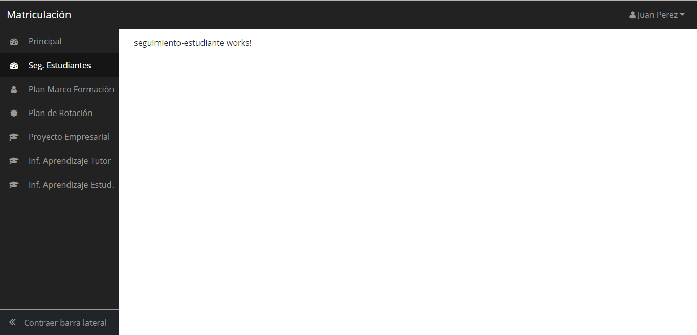

# Angular7 and Bootstrap 4

This project was generated with [Angular CLI](https://github.com/angular/angular-cli) version 7.0.4.

### How to start

**Note** that this seed project requires **node >=v8.9.0 and npm >=4**.

In order to start the project use:

```bash
$ git clone https://github.com/tanoss/GestionDualCliente.git
$ cd GestionDualCliente
$ npm install
$ npm start
# Navigate to `http://localhost:4200/`
```

## FUNCIONAMENTO

1.- Interfaz

